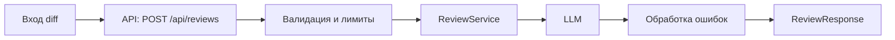

# ADR: решение для первого рабочего сценария

- Статус: proposed
- Дата: 2026-09-15
- Ответственные: команда разработки (учебный сценарий)

## Контекст

По TRAINING_PR.diff добавлен эндпоинт POST /api/reviews и сервис ReviewService.review, который пересылает сырой diff в LLM и возвращает {"comment": …}. По результатам промптов выявлены риски:
- отсутствует валидация входа (KeyError → 500 вместо 422);
- использование аннотаций dict[...] (совместимость Python <3.9 неизвестна);
- нет response_model → неточный OpenAPI;
- отсутствует обработка ошибок LLM;
- нет ограничений на размер diff → риск DoS/стоимости;
- смешение слоёв (сервис формирует API-ответ);
- слабый промпт и риск prompt injection;
- отсутствуют тесты под новую логику.

## Решение

Минимальный набор изменений для первого рабочего сценария:
- Ввести Pydantic-модели: ReviewRequest { diff: str } (с ограничением длины) и ReviewResponse { comment: str }; указать response_model в роуте.
- Обеспечить корректные статусы: 422 для невалидного тела, 413 при превышении max длины, 502/503 для ошибок LLM (с логированием).
- Ограничить размер diff; при превышении возвращать 413, при необходимости выполнять усечение/суммаризацию.
- Разделить ответственность: ReviewService возвращает строку; формирование DTO на уровне API.
- Укрепить промпт: экранировать diff (кодблок), задать формат и лимит ответа.
- Привести аннотации к совместимым (typing.Dict или зафиксировать python>=3.9).
- Добавить unit, integration и e2e проверки для позитивных/негативных сценариев.

## Рассмотренные альтернативы

| Альтернатива | Почему не выбрали сейчас |
|---|---|
| Ручная проверка тела без Pydantic | Увеличивает риск рассинхронификации и ошибок; хуже DX и OpenAPI |
| Отсутствие лимита размера diff | Риск DoS/стоимости/таймаутов |
| Оставить сервис возвращающим dict | Усиливает связность слоёв, снижает переиспользуемость |
| Жёстко зафиксировать python>=3.9 | Возможны ограничения окружений; пока используем совместимые аннотации |

## Последствия и главный риск

- Положительные последствия: стабильный контракт API (422/413/5xx), предсказуемая работа с большими входами, улучшенная документация.
- Ограничения: максимальная длина diff; возможная усечённость комментария; дополнительные ветки обработки ошибок.
- Главный риск: непредсказуемость LLM-ответов и стоимость при росте нагрузки.
- Как проверим риск: нагрузочные и интеграционные тесты с моками LLM; мониторинг p95; проверка устойчивости к prompt injection.

## Архитектурная схема

## Как использовали AI

Для чего: идентифицировать риски по TRAINING_PR.diff и сформировать минимальное решение
- Тип промпта: AI-reviewer с ограничением на источник (prompt_P1_02)
- Строка в [`prompts.md`](prompts.md): см. practices/practice_01/prompt_P1_02.md и prompt_P1_01.md
- Что проверили и исправили сами: адаптировали выводы под реалистичные статусы/ограничения и распределили ответственность между слоями
