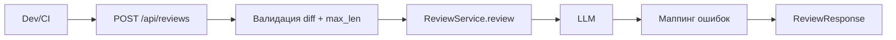

# Анализ процесса: AS IS и TO BE

Файл ведёт OpenCode. Обсудите с агентом содержание и проверьте предложенный diff. Все дополнения и исправления поручайте агенту в чате.

## AS IS

Событие: разработчик/CI хочет получить ревью изменений.

Процесс сейчас (строго из TRAINING_PR.diff по выводам промптов):
- Клиент отправляет JSON с полем diff на POST /api/reviews.
- Эндпоинт без валидации извлекает payload["diff"]. При отсутствии ключа возникает KeyError → 500.
- ReviewService формирует простой промпт с прямой интерполяцией diff и вызывает LLM.
- Ответ LLM возвращается как {"comment": <string>} без формального response_model.

Участники: разработчик/CI, FastAPI-роут, ReviewService, LLM.
Точки задержки/риска: отсутствие валидации, нет лимита размера diff, нет обработки ошибок LLM, слабый промпт (риск инъекции), отсутствие auth/rate limit (если задействовать вне внутренней сети).

## TO BE

Минимальные изменения для первого рабочего сценария:
- Ввести Pydantic-модели ReviewRequest { diff: str } и ReviewResponse { comment: str }.
- Валидация: обязательное поле diff; стандартный 422 на неверном теле.
- Ограничение размера diff (например, max_len) и 413 при превышении.
- Обработка ошибок LLM: маппинг в 502/503 с логированием.
- ReviewService возвращает строку; формирование DTO на уровне API.
- Промпт: экранирование diff (кодблок), инструкции по формату и ограничениям ответа.

## Разница

| Что меняется | AS IS | TO BE | Как проверим изменение |
|---|---|---|---|
| Валидация входа | Нет | Pydantic ReviewRequest → 422 | POST {} → 422, POST без diff → 422 |
| Ограничение размера | Нет | max_len и 413 | diff длиной > max_len → 413 |
| Формат ответа | Произвольный dict | ReviewResponse { comment } | Контрактный тест: поля и типы |
| Обработка ошибок LLM | Нет | 502/503 с деталями | Стаб/мок LLM → исключение → 502/503 |
| Промпт | Неэкранированный diff | Экранирование и инструкции | Юнит-тест на генерацию промпта |

## Как использовали AI

Для чего: сформировать AS IS/риски из TRAINING_PR.diff и наметить минимальные изменения
- Тип промпта: AI-reviewer с ограничением по источникам; поиск рисков и чеков
- Строка в [`prompts.md`](prompts.md): см. prompt_P1_02.md и prompt_P1_01.md
- Что проверили и исправили сами: соотнесли риски с изменениями, добавили проверяемость через статусы 422/413/5xx
