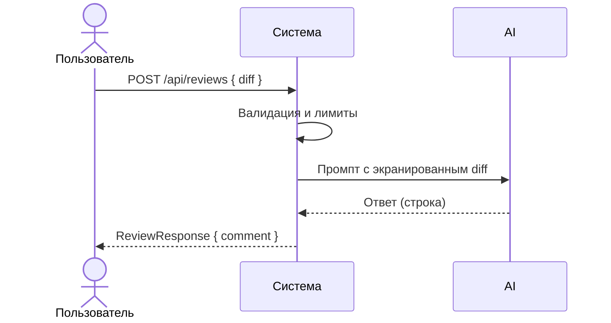

# Use cases и user stories

Файл ведёт OpenCode. Обсудите с агентом содержание и проверьте предложенный diff. Все дополнения и исправления поручайте агенту в чате.

## Первый рабочий сценарий

**Когда** разработчик или CI отправляет корректный JSON с полем diff на POST /api/reviews, **система** валидирует вход, ограничивает размер, формирует безопасный промпт, вызывает LLM и возвращает структурированный ответ, **а пользователь получает** предсказуемый JSON {"comment": string} или понятную ошибку (422/413/5xx).

Не входит в этот сценарий:

- Аутентификация/авторизация, биллинг, внешняя публикация OpenAPI

## Use case

| Поле | Значение |
|---|---|
| Актор | Разработчик/CI |
| Триггер | Появился diff для проверки |
| Предусловия | Доступен эндпоинт /api/reviews; соблюдены лимиты размера |
| Основной результат | 200 OK и ReviewResponse { comment } |
| Ошибка или отказ | 422 при неверном теле; 413 при превышении лимита; 502/503 при ошибке LLM |



## User stories и acceptance criteria

```gherkin
Feature:

  Scenario: Позитивный
    Given доступен эндпоинт /api/reviews
    And тело запроса содержит корректное поле diff в допустимых пределах
    When отправляю POST /api/reviews
    Then получаю 200 OK
    And тело соответствует ReviewResponse { comment }

  Scenario: Негативный или граничный
    Given тело запроса не содержит поля diff или превышает лимит
    When отправляю POST /api/reviews
    Then получаю 422 при неверном теле или 413 при превышении лимита
```

## Как использовали AI

Для чего:
- Сформулировать минимальный полезный сценарий на основе выявленных рисков
- Тип промпта: ревью диффа, summary+risks+checks (prompt_P1_02)
- Строка в [`prompts.md`](prompts.md): см. prompt_P1_02.md и prompt_P1_01.md
- Что проверили и исправили сами: уточнили статусы и формулировки ошибок для UX
