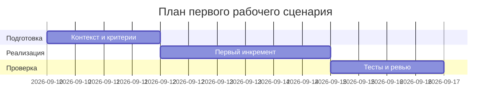

# План поставки

Файл ведёт OpenCode. Обсудите с агентом содержание и проверьте предложенный diff. Все дополнения и исправления поручайте агенту в чате.

## Инкременты и ответственность

| Инкремент | Наблюдаемый результат | Что делает человек | Что делает AI или субагент | Проверка | Зависимости |
|---|---|---|---|---|---|
| 1 | Валидация входа и response_model | Определяет модели, статусы | Генерирует шаблоны моделей/схем | Тесты: {} → 422; валидный → 200 | TRAINING_PR.diff |
| 2 | Лимит diff и обработка ошибок | Настраивает max_len и обработчики | Предлагает промпт и обработку исключений | Тесты: >max_len → 413; мок LLM → 502/503 | 1 |
| 3 | Тесты и документация | Пишет тесты и обновляет README/OpenAPI | Проверяет стабильность ответов | E2E: позитив/негатив | 1,2 |

## Диаграмма Ганта

Передайте OpenCode даты и задачи своего плана и попросите обновить диаграмму.

## Как использовали AI

Для чего:
- Сопоставить риски с планом инкрементов и проверками
- Тип промпта: AI-reviewer и список рисков/чеков (prompt_P1_02)
- Строка в [`prompts.md`](prompts.md): см. prompt_P1_02.md и prompt_P1_01.md
- Что проверили и исправили сами: упорядочили шаги по минимальности изменений
