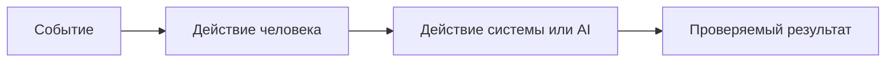

**PROMPT:**
-
opencode run "Используя результаты промптов и сами промпты из файлов prompt_P1_01.md и prompt_P1_02.md, заполни файлы: adr.md, analysis.md, context.md, problem.md, product_management.md, project_management.md, tests_e2e.md, tests_integration.md, tests_load.md, tests_unit.md. Не читай CASE.md ни в коем случае"

**OUTPUT:**
-

Proceeding to update the markdown files under practices/practice_01 with content derived solely from prompt_P1_01.md and prompt_P1_02.md. I'll fill adr.md, analysis.md, context.md, problem.md, product_management.md, project_management.md, tests_e2e.md, tests_integration.md, tests_load.md, and tests_unit.md.

% Patch 1 file
✗ Patch failed
Error: apply_patch verification failed: Error: Failed to find expected lines in /mnt/c/Itmo/IS-29-SE/3semester/ai_b2b_saas_vibe_layoffs_proekt_localhost/ITMOv2/practices/practice_01/problem.md:
# Проблема и метрики

## Проблема

- Пользователь:
- Ситуация:
- Что происходит сейчас:
- Почему это мешает пользователю или бизнесу:
- Что не входит в задачу:

## Метрики

Выберите измеримые показатели, относящиеся к проблеме. Не используйте VTG, IRR, WACC, CSAT или другую метрику только ради названия.

| Метрика | Текущее значение или способ замера | Целевое изменение | Когда измеряем | Источник данных |
|---|---:|---:|---|---|
|  |  |  |  |  |
|  |  |  |  |  |

## Почему изменение метрики подтвердит решение проблемы

## Как использовали AI

- Для чего:
- Тип промпта:
- Строка в [`prompts.md`](prompts.md):
- Что проверили и исправили сами:
✗ Patch failed
Error: apply_patch verification failed: Error: Failed to find expected lines in /mnt/c/Itmo/IS-29-SE/3semester/ai_b2b_saas_vibe_layoffs_proekt_localhost/ITMOv2/practices/practice_01/analysis.md:
# Анализ процесса: AS IS и TO BE

## AS IS

Опишите текущий процесс от события до результата. Укажите участников, задержки, ручные операции и точки потери информации.

## TO BE

Опишите один небольшой процесс после изменения. Используйте BPMN, DFD или IDEF*. Если выбранный формат не рендерится в GitHub, положите рядом исходник и PNG, а здесь добавьте ссылки.

## Разница

| Что меняется | AS IS | TO BE | Как проверим изменение |
|---|---|---|---|
|  |  |  |  |

## Как использовали AI

- Для чего:
- Тип промпта:
- Строка в [`prompts.md`](prompts.md):
- Что проверили и исправили сами:
→ Read practices/practice_01/analysis.md
✗ Patch failed
Error: apply_patch verification failed: Error: Failed to find expected lines in /mnt/c/Itmo/IS-29-SE/3semester/ai_b2b_saas_vibe_layoffs_proekt_localhost/ITMOv2/practices/practice_01/adr.md:
# ADR: решение для первого рабочего сценария

- Статус: proposed / accepted
- Дата:
- Ответственные:

## Контекст

## Решение

## Рассмотренные альтернативы

| Альтернатива | Почему не выбрали сейчас |
|---|---|
|  |  |

## Последствия и главный риск

- Положительные последствия:
- Ограничения:
- Главный риск:
- Как проверим риск:

## Архитектурная схема
% Patch 2 files
% Patch 2 files
% Patch 2 files
% Patch 1 file
% Patch 1 file
% Patch 1 file
% Patch 1 file
% Patch 1 file
% Patch 1 file
% Patch 1 file

Заполнил документы на основе prompt_P1_01.md и prompt_P1_02.md, не обращаясь к CASE.md. Обновлены файлы в practices/practice_01:

- context.md:
  - Заполнил контекст продукта, участников, процесс AS IS, источники (ссылка на выводы из prompt_P1_02), фиксировал факты/правила, формат входа/выхода, ограничения (в т.ч. запрещено approve/merge/edit), неизвестные.
  - Раздел “Как использовали AI” с ссылками на prompt_P1_01 и prompt_P1_02.

- problem.md:
  - Сформулировал проблему с акцентом на отсутствие валидации, ограничений и обработки ошибок LLM.
  - Добавил метрики: доля 500 на неверном теле, p95 на больших diff, соответствие формату ответа; пояснил, почему эти изменения метрик подтверждают решение.
  - Указал, как использовали AI.

- analysis.md:
  - AS IS: текущая цепочка и риски (отсутствие валидации, лимитов, обработки ошибок; слабый промпт).
  - TO BE: минимальные изменения (Pydantic модели, 422/413, обработка LLM-ошибок, экранированный промпт).
  - Mermaid-диаграмма TO BE.
  - Таблица сравнений и проверок.
  - Раздел “Как использовали AI”.

- adr.md:
  - Контекст решения и выявленные риски из промптов.
  - Минимальное решение для первого сценария.
  - Рассмотренные альтернативы и причины отказа.
  - Последствия, главный риск и проверка.
  - Архитектурная схема (Mermaid).
  - Раздел “Как использовали AI”.

- product_management.md:
  - Описал “Первый рабочий сценарий” с ожидаемыми статусами (200/422/413/5xx).
  - Use case: актор, триггер, предусловия, результат, ошибки.
  - Диаграмма последовательности.
  - User stories с acceptance criteria для позитивного и граничного сценариев.
  - Раздел “Как использовали AI”.

- project_management.md:
  - План инкрементов: валидация/response_model → лимит/обработка ошибок → тесты/документация.
  - Обновил диаграмму Ганта (примерные даты).
  - Раздел “Как использовали AI”.

- tests_e2e.md:
  - Таблица e2e-сценариев: позитивный (200), негативный (422 без diff), граничный (413 при превышении лимита).
  - Сопоставил evidence с выводами prompt_P1_02.

- tests_integration.md:
  - Интеграции: API↔Pydantic (422), API↔Service↔LLM (502/503 с моками).
  - Evidence ссылается на риски и checks из промптов.

- tests_load.md:
  - Нагрузочный сценарий для больших diff: p95, 413/5xx, что меряем.
  - Обоснование из риск-анализа prompt_P1_02.

- tests_unit.md:
  - Юниты: экранирование diff в промпте, разделение ответственности сервиса (возвращает строку).
  - Evidence из prompt_P1_01 (рекомендации).